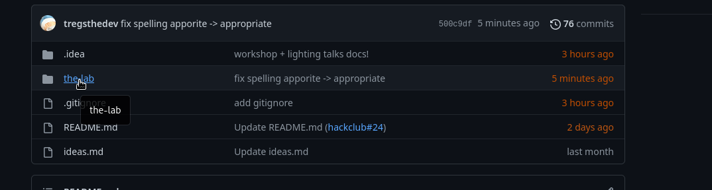
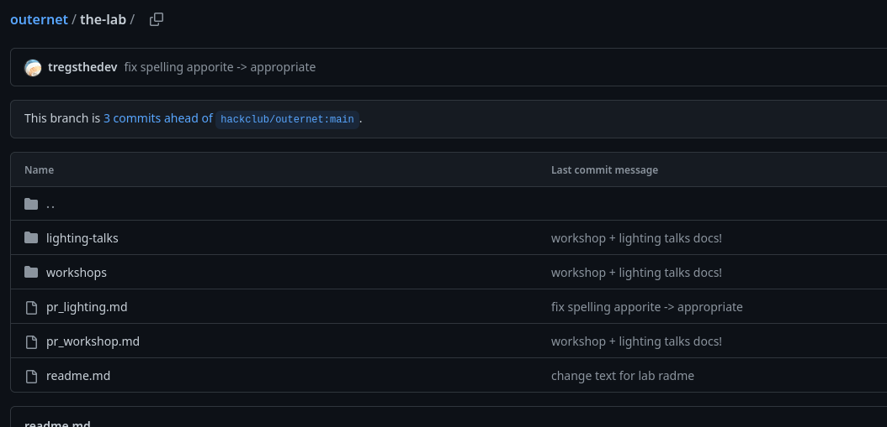
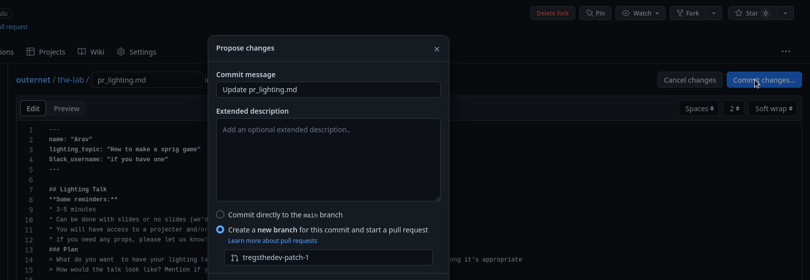
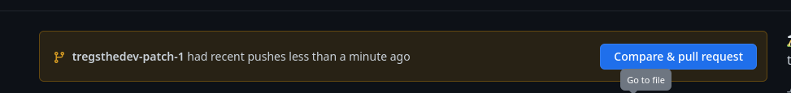

> Imagine a place where you can learn something new, and come out with something of your own! Something technical or nerdy like your own programming language, or maybe your very own canvas of art or even a restored Mac. There's no limit to what a workshop or lightning talk can be (as long as it's legal :p), the only limit is your imagination!

# How to Submit Your Workshop / Lightning Talk

1. Fork the [``hackclub/outernet``](https://github.com/hackclub/outernet) repo:    
    
2. Head to your fork of the repo and navigate to ``the-lab`` folder:    
       
3. Select the appropriate template: `pr_workshop.md` and/or `pr_lightning.md`:    
   

4. Change the file name in respect to if it's a `lightning-talk` or `workshop` to the right folder. For example: `/the-lab/workshops/name-of-workshop.md` or `/the-lab/lightning-talk/your-name.md`.
  
5. Edit the template with the steps outlined in each template + commit it

6. Make a PR for your template by going back to the homepage + clicking `Compare & Pull Request`:

7. Done! Someone will review and get back to you soon! 

## What's next?

* Someone will review your PR and leave questions and/or comments.
* We'll help you make your outline/idea better.
* After we've reviewed it for the first time, we'll prompt you to edit your document with more information.

If you have any questions, please let us know in `#outernet-lab`!
